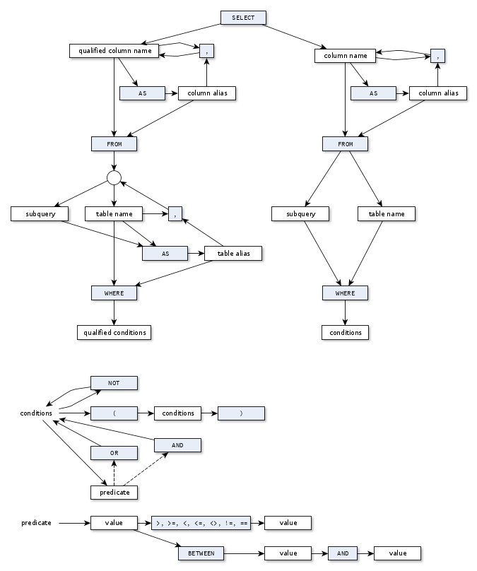

# Input query syntax

All query should fit a single line and comments are not supported.
The basic sql query syntax is the following:

**query**: `SELECT columns FROM tables WHERE conditions`

**columns**: comma separated list of column names or
           `column-name AS column-alias` expressions.
**tables**: a comma separated list of tables or `table AS table-alias`
          expressions.`. A table can be either a table name or a subquery
          (between parentheses).

**conditions** Logic tree of column relations of literals.
               Logic relations `and`, `or`, `not`, are supported.

**column predicates**: `<`, `<=`, `>`, `>=`, `<>` or `!=`, `BETWEEN _ AND _`

**literals**: Strings between double quotes, signed/unsigned long/double numbers.

**column/table name**: A single identifier.

After rewriting, a column name is a simple identifier as a symbol.
A qualified column name has both a table alias (as symbol namespace)
and a column alias (symbol name) in `table-alias/column-alias` format.
Column names without `/` are unqualified.

## Query syntax

